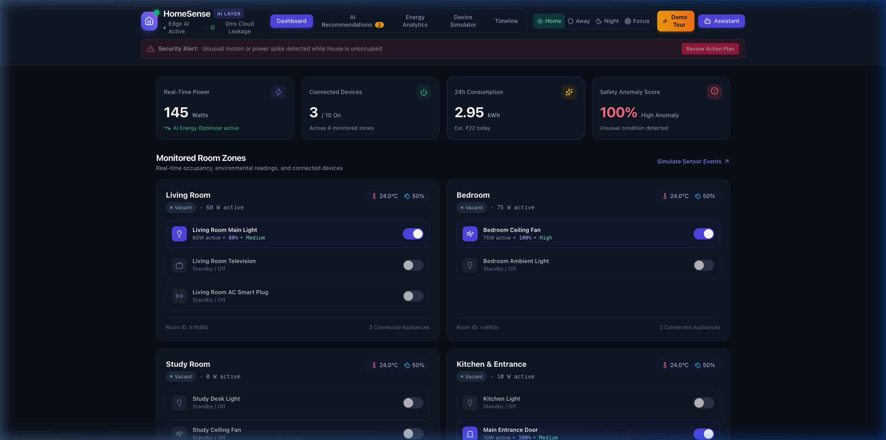
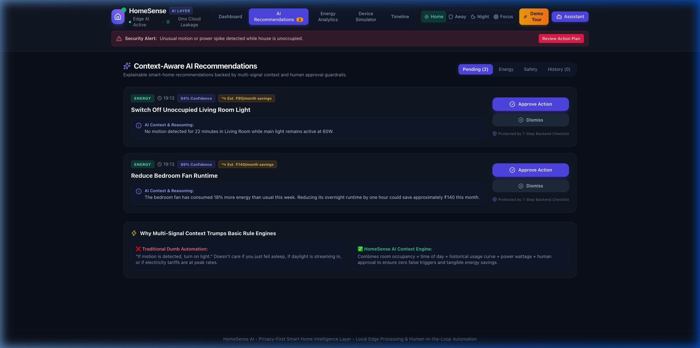

# 🏠 HomeSense AI
> **Privacy-First Smart Home Intelligence Layer**  
> Context-aware household intelligence, mathematical anomaly detection, energy optimization, and human-in-the-loop safety without cloud telemetry leakage.

[](https://homesense-ai.onrender.com/)

[](https://render.com/deploy?repo=https://github.com/psryogeshwar-14/homesense-ai)


---

## 🌟 Overview

Current smart home assistants either rely on rigid, fragile "if-this-then-that" rules or constantly transmit audio, camera feeds, and occupancy telemetry to remote big-tech cloud servers. 

**HomeSense AI** changes this paradigm with an **edge-native intelligence layer**:
- 🛡️ **Zero Cloud Presence Leakage**: 0 bytes of occupancy or sensor streams are sent to public clouds.
- ⚡ **Local Tabular Anomaly Engine**: Detects safety deviations and unauthorized entries in sub-15ms with mathematical outlier scoring.
- 💡 **Context-Aware Energy Optimization**: Learns household routines to eliminate vampire energy draw and projects monthly electricity bill savings in ₹.
- 🤝 **Strict Human-in-the-Loop Safety**: Natural language commands (*"Prepare study room for a 45-minute session"*) produce bounded action plans verified against a strict 7-step integrity checklist requiring human approval before modifying physical devices.
- 🌐 **Offline Resiliency**: Operates at 100% functionality during internet outages.

---

## 📸 Interface Previews

| Live Smart Home Dashboard | Explainable AI Recommendations & Safety |
|---|---|
|  |  |

> 📌 **Quick Documentation Links**:
> - 📊 **[Pitch Deck Outline (8 Slides)](docs/PITCH_DECK.md)**
> - 🎬 **[11-Step Interactive Demo Walkthrough Guide](docs/WALKTHROUGH.md)**

---

## 🏗️ System Architecture

```
[ Ambient Sensors / Simulated Matter Devices ]
                       │
                       ▼ (Local Network / WebSockets)
     ┌──────────────────────────────────────────────────┐
     │              HOMESENSE LOCAL CORE                │
     │  • Tabular Anomaly Engine (Deviations & Alerts)  │
     │  • Context & Rule Engine (Occupancy + Load + Time│
     │  • Dual NLP Engine (Gemini LLM + Local Fallback) │
     │  • Strict 7-Step Human-in-the-Loop Safety Gate   │
     └──────────────────────────────────────────────────┘
                │                               │
                ▼ (Sanitized Action Only)       ▼ (Sub-15ms Live Updates)
     [ Optional Cloud LLM ]            [ React 19 Unified UI ]
    (Zero PII / Zero Telemetry)       (Dashboard, Energy, Simulator)
```

---

## ✨ Key Features

1. **Live Energy & Anomaly Dashboard**:
   - Real-time power load monitoring across living room, bedroom, study room, and kitchen.
   - Dynamic safety badge classifying home state into `NORMAL`, `REVIEW`, and `HIGH_ANOMALY`.
2. **Explainable AI Recommendations Queue**:
   - Clear causal rationale for every suggestion (*"Bedroom fan running for 24 minutes in an empty room after 11 PM"*).
   - Instant ₹ monthly electricity bill savings projection.
3. **Interactive Device Simulator**:
   - 1-click test scenarios (*Empty House Anomaly, Study Routine, Nighttime Waste, Baseline Reset*).
   - Hardware matrix to trigger PIR motion, door reed switches, and temperature variations.
4. **Natural-Language Assistant Drawer**:
   - Parses multi-device requests into structured action plans.
   - Dual-engine: Gemini API (when configured) + local deterministic edge heuristic parser.
5. **Explainable Timeline**:
   - Audit trail of sensor events, AI reasoning, and approved device states.
6. **Built-in 11-Step Demo Tour**:
   - 1-click guided presentation script directly embedded into the web app for hackathon judges and demos.

---

## 🚀 1-Click Deployment to Render

You can deploy the entire full-stack app (React 19 Frontend + Express/Socket.IO Backend + SQLite) for free on Render:

1. Go to [dashboard.render.com](https://dashboard.render.com/) and click **New +** $\to$ **Web Service**.
2. Connect this repository: `https://github.com/psryogeshwar-14/homesense-ai`.
3. Render automatically picks up `render.yaml`:
   - **Build Command**: `npm install && npm run build`
   - **Start Command**: `npm start`
   - **Plan**: `Free`
4. Click **Deploy Web Service** — your app will be live in 2 minutes!

---

## 💻 Local Development

### Prerequisites
- Node.js 18+ (tested on Node v20/22/26)
- npm 9+

### Setup & Run
```bash
# 1. Clone repository
git clone https://github.com/psryogeshwar-14/homesense-ai.git
cd homesense-ai

# 2. Install dependencies for all packages
npm run postinstall

# 3. Setup SQLite database & seed baseline data
npm run prisma:push
npm run prisma:seed

# 4. Start Development Servers
# Terminal 1: Backend API & Socket Server (port 3001)
npm run dev:server

# Terminal 2: React Frontend with Vite HMR (port 5173)
npm run dev:client
```

Open [http://localhost:5173](http://localhost:5173) in your browser.

---

## 📜 7-Step Safety Checklist for AI Actions

Every action generated by HomeSense AI must pass 7 backend gates before touching hardware:
1. `Recommendation / Action Exists`
2. `Action Status is Pending`
3. `Target Hardware Device Exists in Database`
4. `Action Type Whitelisted (TURN_OFF, TURN_ON, SET_BRIGHTNESS, REDUCE_SPEED)`
5. `Explicit Human Approval Logged`
6. `Device Event Audit Record Created`
7. `State Mutated and Broadcast over WebSockets`

---

## 📄 License
MIT License. Built for the Hackathon Phase 1 Prototype.
